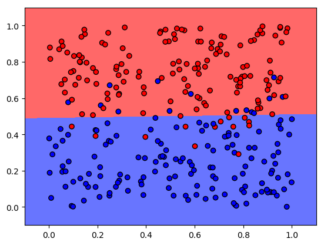
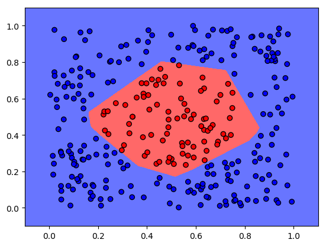

### No activation function case (Linear regression case)

OK, but what do I mean by this? Well, **first**, let's suppose that we have a number of neurons that are chained together and that there is no activation function.
So, the equation of the output of the last neuron will take the form of:

https://latex.codecogs.com/svg.image?a_i=b&plus;w_0&space;x_0&plus;w_1&plus;x_1&plus;...&plus;w_m&space;x_m

$$ a_i = b + w_0 x_0 + w_1 + x_1 + ...+ w_m x_m $$
Credits to wikipedia:

So, if we want to predict a linear regression without the classic equation:

https://latex.codecogs.com/svg.image?b_1=\frac{\sum_{i=0}^{n}(x_i-\bar{x})(y_i-\bar{y})}{\sum_{i=0}^{n}(x_i-\bar{x})^{2}}

https://latex.codecogs.com/svg.image?b_0=\bar{y}-(b_1\bar{x})

https://latex.codecogs.com/svg.image?y=b_0&plus;(b_1&space;x)

$$b_1 = \frac{\sum\limits_{i=0}^n  (x_i-\bar{x})(y_i-\bar{y})  }{\sum\limits_{i=0}^n  (x_i-\bar{x})^{2} }$$

$$b_0 = \bar{y}-(b_1\bar{x})$$

$$ y = b_0 = b_1 x $$

**Therefore, An activation function will exists if we want to do better things. Other wise our network will be limited to perform only a linear regression.**

### Binary Classification case (Logistic regression case)

Now, **second**, let's suppose that we have set of incomes and we want to classify them by type red and blue:
With a linear activation function we collapse again in a linear regression case:

And it will be impossible with a network of neurons to classify things like this:

Image source: https://cfml.se/blog/binary_classification/

- **First** because of the curve of the function is a line.
- However, so far I have not talked at all about learning of neural networks with backpropagation.
 The **second** reason which you can find, when you try to train the neuron:
  the the setting of the neuron weights will be the same while you apply backpropagation, no matter what the input is.
  In other words, without knowing backpropagation method, you simply cannot use the activation function as a universal approximation function.

**Therefore, An activation function will be non-linear if we want to do better things. Again, other wise our network will be limited to perform only a linear clasification.**

### The activation function must be continuously deferentiable
