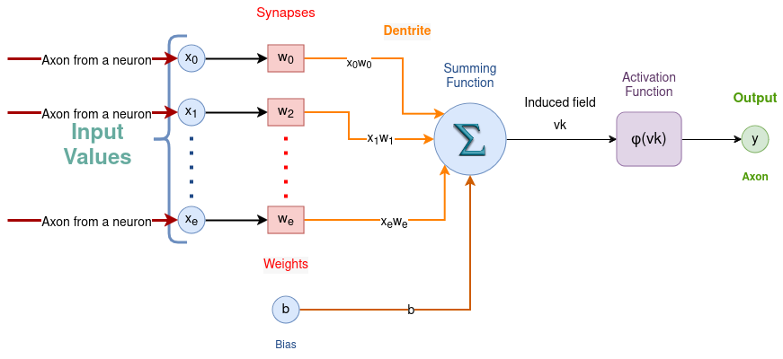

# CNN
Hello, my main Idea here is explain how a CNN works by baby steps and from zero.

Machine learning is nothing but a geometry problem.

## The Neuron (on feed-fordward direction)
The basic unit of the neural network is the neuron. It will ignore neither the layer to which it belongs nor its position in it.

Every neuron in an artifitial neuron network (a.k.a. ANN) consists of 0 to e **entries** called **inputs**.

The inputs are numbers like 1, 2, 0.34, -10.5 , and so on.

Each input of neuron x0, x1, ...xe could correspond to an input of the neural network, in other cases it could correspond to the output of another neuron of our neural network, as well as it could correspond to the output of ‘another component’ of our neural network. 

Each entry is associated with a **weight** called a **synapse**.

Each entry is multiplied with its synapse, this result is called **dentrite**.

Optionally there is an extra entry. It is a fixed input (+1 , 0, or -1) which is not associated with a synapse, It is called **bias**.

When all the dentrites and the bias are added together it is called vk.
Each entry x is associated with a synapse's weight w. ( From 1 to e )
Treat the bias like a fixed entry if it exists.

[https://latex.codecogs.com/svg.image?vk=\sum_{j=0}^{e}(x_{j}w_{j}&plus;b)](https://latex.codecogs.com/svg.image?vk=\sum_{j=0}^{e}(x_{j}w_{j}&plus;b))

$$vk = \sum_{j=0}^e \left( x_j w_j +b \right)$$

Every neuron has one **activation function**.
When the activation function of the neuron is applied to vk, the outcome of the neuron is obtained. It is called **ŷ** **a** or **axon**.

https://latex.codecogs.com/gif.latex?a_i%20%3D%20f%28vk%29

$$a_i = f \left( vk \right)$$

So, looking backwards, I can say Those entries could correspond to axons of other neurons.

## The activation function

What form, or rather, what is the nature of this function? The activation function is the transfer function between neurons.

The answer is that there is no single activation function used, and the activation function is selected according to the desired behaviour by experimentation.

Please see the page: https://github.com/fllaryora/CNN-and-C-/blob/main/Activation_function.md

## ANN layer

Please see the page: https://github.com/fllaryora/CNN-and-C-/blob/main/layers.md
