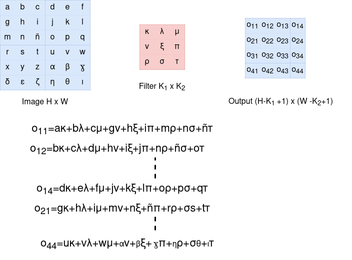

# Convolution and the cross correlation

In mathematics there are several tools that allow us to transform one thing into another thing.
Linear transformation, which is nothing more than a simple matrix multiplication but with a purpose, e.g.
The Quake engine moves the character around the map, each rotation has its matrix, each advance has its matrix.
The Laplace transform is another tool that transforms one thing into another, "but by altering its universe where it resides,
 it takes it to another dimension". 

The laplace transform is heavy and could be optimised into something fast called the FFT discrete fast fourier transform.

This tool transforms a tube full of signals and separates them, and is widely used in sound.
It transforms many signals with amplitude as a function of time into signals with amplitude
as a function of frequency, where these signals are differentiable.

## The reason of the need of a tool of transformation

The artificial neural network is a good tool, but have you ever stopped to think about how the network sees the world?
Humans have millions of skin cells to sense touch, thousands of cones and rods to see the world well,
2 ears that pick up a wide span of frequencies.
The ANN, on the other hand, has few inputs. In other words, we are born with a "great myopia". 

We need a mathematical tool, a pair of mathematical glasses to cure the myopia of the poor ANN.

The idea here is to find a cheap tool to compute mathematical transformation.

Cross correlation is the cheaper version of convolution.

## Convolution

**Convolution** is a mathematical operation on two functions that produces a third function:
One dimention version: (for time for instance).
(t):=\int_{-\infty}^{\infty}f(\tau)g(t-\tau)d\tau)

The term convolution refers to both the result function and to the process of computing it.
An equivalent definition using commutativity is: 
(t):=\int_{-\infty}^{\infty}f(t-\tau)g(\tau)d\tau)

The discrete form is:
[n]=\sum_{m=-\infty}^{\infty}&space;f[m]&space;g[n-m])

using commutativity is: 
[n]=\sum_{m=-\infty}^{\infty}&space;f[n-m]&space;g[m])

### How are the data represented?

A function represents the data stream that IT is going to process to transform and
the function that transforms is a small one, which is called **kernel** of **filter**.

In the case of Deep Learning (Convolutional Neural Networks to be precise), weights of the kernel(a small matrix) are
learnt during training using backpropagation and are not defined/set explicitly.

In order to be able to process a convolution using for programming cycles, the data stream of the functions must be flipped.

**Flippong is a downer** because it makes the things more expensive.

### What is the difference between convolution and cross correlation?

Convolution in CNN involves flipping all the dimensions, for instance 2D both the rows and columns of the kernel before sliding it over the input,
while cross-correlation skips this flipping step.

These operations are foundational in extracting features and detecting patterns within the data, despite their technical differences.

The cross correlation (1 Dimension, time for instance) form is:
[n]=\sum_{m=-\infty}^{\infty}&space;f[n+m]&space;g[m])

Images taken from: https://glassboxmedicine.com/2019/07/26/convolution-vs-cross-correlation/
Author: Rachel Draelos, MD, PhD

The cross correlation (2 Dimension, 2D gray image for instance) form is:
This is 1 grayscale kernel layer.
For the row i, and column j:

[i][j]=\sum_{i'=0}^{k-1}\sum_{j'=0}^{k-1}&space;A[i+i'][j+j']&space;W[i][j])

The cross correlation (3 Dimension, 2D color image for instance) form is:
This is 3 grayscale kernel layer.
For the row i, and column j, C colors:

[i][j]=\sum_{i'=0}^{k-1}\sum_{j'=0}^{k-1}\sum_{c=0}^{C-1}&space;A[i+i'][j+j'][c]&space;W[c][i][j])

In most case when you read a pixel from a photo file for each channel (red, blue , green, alpha/opacity ) you get a value between 0 to 255 (integer).
**So, please map this value to 0.0 to 1.0 (float).**
The convolution and cross-correlation, can be seen as a small window that sits on top of the incoming data strem.
Each time it lands on a part of the data stream it generates an output. Then it moves a bit.
A quantity called a **stride** It lands again on another part of the data stream and generates a new output,
and so on until it has covered the full width of the input. 

### Another way to view it.

### Cross correlation vs matrix multiplication

The matrix multiplication (vector times vector) is:

Taken from: https://www.physicsread.com/latex-matrix-multiplication/

And the relation ship between the dimensions of the input and the output are:
taken from wikipedia:

$$A_{mn}xB_{np}=C_{mp}$$
We multiply "rows" against "columns".

**We can emulte a cross correlation with a matric multiplication but this is a waste of space and computation:**
Let us supose a 2x2 kernel.

For 9 *words* (a word is the amount of bits that naturally take the cpu at time) we have a lot of useless 0s.
Now if we have an image of some kilobites, we have a Megas wasted.

# A bit of Architecture

In this page: https://github.com/fllaryora/CNN-and-C-/blob/main/layers.md, we talk of the layers of an ANN.
But now if we are talking of a CNN, the ANN layers are the last layers of our CNN.
The CNN layers are the layers in charge of modeling the reality to short-sighted ANN.
So just imagine having a 1920x800 image and a first hidden layer with 100 neurons.
those filters must be very specific to only let pass 100 significative variables.

## The cross correlation as the filter layer.

Previewsly we compared the cross correlation with the matrix multiplication now we are going to talk about the dot product or scalar produt.
The **dot product** is an algebraic operation that takes two equal-length sequences of numbers (usually coordinate vectors), and returns a single number.

$$\vec{p} \cdot \vec{q}=\left | \vec{p} \right |\left | \vec{q} \right |\cos\theta$$

$$\vec{p}\cdot\vec{q}=x_{1}x_{2}+y_{1}y_{2}+z_{1}z_{2}$$

The magic of the dot product is that if the two vectors of the dot product point to very similar places the result of the operation is positive. If both vectors point to almost opposite places, the sign of the operation is negative, if they are at 90 degrees the result is almost 0.

What the fuck does this have to do with our cross correlation? That the operations are similar,
 and if we get **positive** numbers, it means that the **filter applied has found what the filter was looking for**.
 If the operation gets **0 or negative** numbers, it means that the **filter hasn't found what the filter was looking for**.
 The filter did not find the feature searched for in the input. That's why the kernel is also called a **feature**.

This gives the opportunity to spoil you the following:
The layers that follow the cross-correlation will enlarge the value obtained in order to know whether or not the value sought is present or not.

For example, if I have a kernel to detect noses. And I have a face as input, it will only give high positive values where the nose is.
I don't care where, the exact place, that gave positive for noses.
Future layers won't care about the location of the nose either.
You only want to know, whether or not there is a fucking nose at the input, nothing else.  

### The change of shape of the layers (Valid, Same and Full)

I like: this PDF http://arxiv.org/pdf/1603.07285
