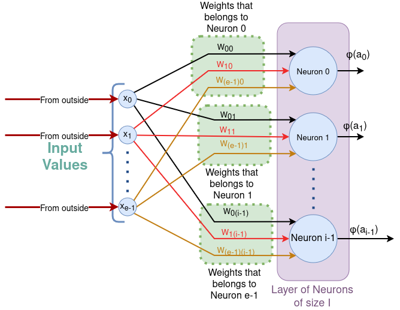
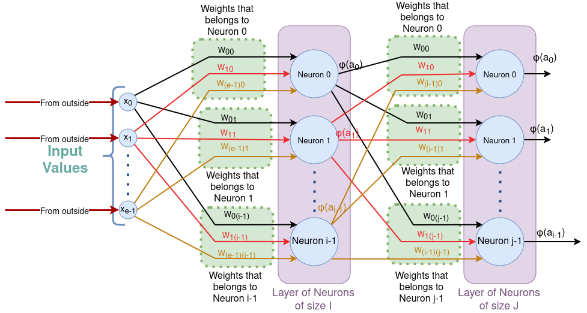
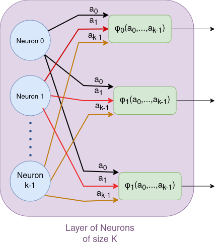

# Architecture
As we saw before, the artificial neuron with its activation function is a model of a real neuron.
For an efficiency reason, I think, because I don't know if there are other reasons, we group the artificial nuerones in **layers**.
Layers are nothing but another model.
Here you are the first example:

There are things here that lend themselves to confusion. First: The ‘Input layer’ doesn't exist, that's why I made sure not to draw it.
The second thing that lends itself to confusion is whether or not the neurons within the layer are interconnected.
The whole model consist of **layers** of interconnected 'neurons' that process and transmit information.
In Feedforward Neural Networks (ANN): Each neuron in a layer is connected to all the neurons in the next layer.
On Recurrent Neural Networks (RNNs) or Convolutional Neural Networks (CNNs) the rules of the game change.

On the second image you can see how 2 layers are interconnected.
So, At programming time, and choosing wisely the data structure that best fits (represents) the neural network,
 instead of choosing to group all the weights of the entire neural network in one place an irregular 3-D array,
 we choose to group the weights of each layer into a 2-dimensional array.
 
Why? Because each layer has difftent size (shape). Over all I can chose differents activation functions for different layers.
For a very common example: 1 hidden layers with 8 neurons and ReLU activation function. Next to  1 final layer with 3 neurons and softmax activation function.

What is the size of the layer:

The 2-D array W is e times I and if you have bias add I to the result.
So, For instance If I have 3 entries and 6 neurons the size of W is 18, ans if we have bias, 24.

My idea is to explain layers typical of a CNN in future pages md.

# Softmax amd other colective activation function case
In the page https://github.com/fllaryora/CNN-and-C-/blob/main/Activation_function.md
 I explained that the activation function of a neuron can depend on a single neuron or depend on all the neurons of the layer.
 So I made a image to make it clear about what happen with the interconnection:
 
 

 The layer K, is the last layer of my ANN, and I use a softmax function because I want to use my ANN as a classificator. For instance The input image is a Dog or a  Cat or a door.
 
# The LOSS curve

In the page https://github.com/fllaryora/CNN-and-C-/blob/main/Activation_function.md
 I explained that the activation function of a neuron must be continuously differentiable, because a backpropagation algorithm is employed which is based on the descending gradient. The descending gradient used on a curve points to a local minimum (that is why the method is stochastic, and does not guarantee that it points to a global minimum).

 
