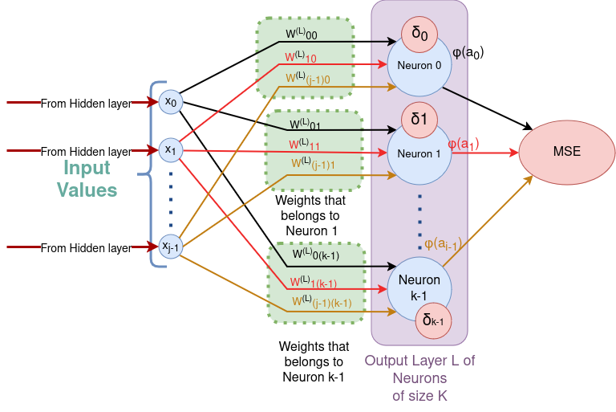
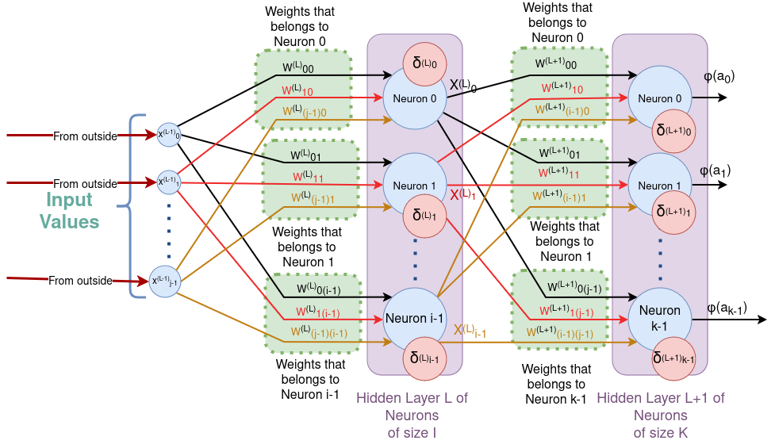

# List of error calculus functions and their derivatives. 
These functions give the error curve to be applied to the backpropagation algorithm. To search for a local or global minimum with luck. 

## Mean Square Error method for regression

 $$MSE(\vec{y},\vec{\hat{y}})=\frac{1}{K}\sum_{k=1}^{K}( y_i - \hat{y}_i)^{2}$$
 
Old ANN use it even for classification but it is not the best for this purpose.
This method is based on the gausian distribution (bell curve).
MSE is the value for the entire output layer, it is not the individual error for each neuron.

Let the weight from the layer l-1 neuron i to layer l neuron j

$$W_{ij}^{l}$$

We want to calculate each ij

$$\frac{\partial MSE}{\partial W_{ij}^{l}}$$

the rate of change of the lost error function with respect to the given connective weight, so we can minimize it.
Now we consider two cases, the output of the network and the output of some middle hidden layer.

### Notation

$$W_{ij}^{(l)}$$ Weight from neuron j in layer l-1 to neuron i in layer l.

$$b_{i}^{(l)}$$ : Bias for neuron i in layer l.

$$x_{i}^{(l)}$$ : Activation of neuron i in layer l.

$$z_{i}^{(l)}$$ : Pre-activation of neuron i in **hidden layer** l, with j entries, where 

}=\sum&space;_j&space;W_{ij}^{(l)}x_j^{(l-1)}&plus;b_i^{(l)})

$$z_{k}^{(L)}$$ : Pre-activation of neuron k in **output layer** L, with j entries, where 

}=\sum&space;_j&space;W_{kj}^{(L)}x_j^{(L-1)}&plus;b_k^{(L)})

$$\sigma_{i}^{(l)}(z_{i}^{(l)})$$: Activation function in **hidden layer** l.

}(z_{k}^{(L)}))​: Activation function in **output layer** L.Predicted output for neuron i.

$$y_k$$: True label for neuron k. The expected value.

$$\text{MSE} = \frac{1}{k} \sum_{i=1}^{k} (y_k - \hat{y}_k)^2$$ : the Mean Square Error (MSE) With n neurons in the last layer.

## Backward Pass: Derivatives
### Derivative of MSE with Respect to Output Layer Weights $$W_{jk}^{(L)}$$

Chain Rule for Partial Derivative of MSE with Respect to $$W_{jk}$$​:

Chain Rule for Partial Derivative of MSE with Respect to $$b_{k}$$​:

Auxiliar calculous:

$$\frac{\partial \hat{y}_i}{\partial z_i^{(L)}} = \sigma'(z_i^{(L)})$$

$$\frac{\partial z_k}{\partial b_k} = 1$$

$$\frac{\partial z_k}{\partial W_{kj}} = x_{j}^{(L-1)}$$

}}=\frac{1}{K}\frac{\partial}{\partial\hat{y}_k^{(L)}}((y_1-\hat{y}_1)^2&plus;...&plus;(y_k-\hat{y}_k)^2&plus;...&plus;(y_K-\hat{y}_K)^2))

The other part that are not k, are 0. And apply substitution. with the chain rule to get:

$$\frac{\partial \text{MSE}}{\partial \hat{y}_k^{(L)}} = \frac{-2}{n} (y_k - \hat{y}_k )$$

#### Error Signal for Output Neuron k:

}=\frac{\partial\text{MSE}}{\partial\hat{y}_k}\cdot\frac{\partial\hat{y}_k}{\partial&space;z_k}=-\frac{2}{K}(y_k-\hat{y}_k)\cdot\sigma'(z_k^{(L)}))

#### Gradient for Weights $$W_{jk}^{(L)}$$

}}=\delta_k^{(L)}\cdot\frac{\partial&space;z_k}{\partial&space;W_{jk}^{(L)}}=\delta_k^{(L)}\cdot&space;x_{j}^{(L-1)})

### Derivative of MSE with Respect to Hideen Layer Weights $$W_{ij}^{(l)}$$

Propagate the error backward through the network. For each hidden layer, compute the error (gradient) with respect to the output of that layer using the error from the next layer and the weights connecting the layers.
 
The error in the hidden layer is calculated by propagating the next layer error back through the weights, applying the chain rule. The layer l has I neurons index i, and the layer l+1 has K neuton index k.

}}=\sum_{k=1}^{K}\left(\frac{\partial\text{MSE}}{\partial&space;z_{k}^{(l&plus;1)}}\cdot\frac{\partial&space;z_k^{(l&plus;1)}}{\partial&space;x_{i}^{(l)}}\right)\cdot\frac{\partial&space;x_i^{(l)}}{\partial&space;z_{i}^{(l)}}\cdot\frac{\partial&space;z_i^{(l)}}{\partial&space;W_{ij}^{(l)}})

}}=\sum_{k=1}^{K}\left(\frac{\partial\text{MSE}}{\partial&space;z_{k}^{(l&plus;1)}}\cdot\frac{\partial&space;z_k^{(l&plus;1)}}{\partial&space;x_{i}^{(l)}}\right)\cdot\frac{\partial&space;x_i^{(l)}}{\partial&space;z_{i}^{(l)}}\cdot\frac{\partial&space;z_i^{(l)}}{\partial&space;b_{i}^{(l)}})

Auxiliar calculous:

$$\frac{\partial x_i^{(l)}}{\partial z_i^{(l)}} = \sigma'(z_i^{(l)})$$

$$\frac{\partial z_i^{(l)}}{\partial b_i^{(l)}} = 1$$

$$\frac{\partial z_i^{(l)}}{\partial W_{ij}^{(l)}} = x_{j}^{(l-1)}$$

$$\frac{\partial z_j^{(l+1)}}{\partial x_{i}^{(l)}} = W_{ki}^{(l+1)}$$

$$\frac{\partial\text{MSE}}{\partial z_{k}^{(l+1)}} = \delta _k ^{(l+1)}$$

#### Error Signal for hidden Neuron i:

}=\sum_{k=1}^{K}\left(\delta&space;_k^{(l&plus;1)}\cdot&space;W_{ki}^{(l&plus;1)}\right)\cdot\varphi'(z_i^{(l)}))

}}=\delta&space;_i^{(l)}\cdot&space;x_j^{(l-1)})

}}=\delta&space;_i^{(l)})

Why the fuck I spent time with this calculous? Because I will use it in back propagation in a further page.

## Binary Cross Entropy method for Classification

=-\frac{1}{K}\sum_{k=1}^{K}({y_k\log_{e}\hat{y}_k&plus;(1-y_k)\log_{e}(1-y_k)}))

This method is based on the bernoulli distribution .
Binary Cross Entropy is the value for the entire output layer, it is not the individual error for each neuron.

### Notation

$$y_k$$: True label for neuron k. The expected value. **is the actual binary label (0 or 1)**

}(z_{k}^{(L)}))​: Activation function in **output layer** L.Predicted output for neuron i.

### Derivative of BCE with Respect to $$\hat{y}_k$$

$$\frac{\partial \text{BCE}}{\partial \hat{y}_k^{(L)}} = \frac{-1}{K} ( \frac{y_k}{\hat{y}_k} - \frac{1-y_k}{1-\hat{y}_k} )$$

}=\frac{\partial\text{BCE}}{\partial\hat{y}_k}\cdot\frac{\partial\hat{y}_k}{\partial&space;z_k}=\frac{-1}{K}(\frac{y_k}{\hat{y}_k}-\frac{1-y_k}{1-\hat{y}_k})\cdot\sigma'(z_k^{(L)}))

## Categorical Cross Entropy method for Classification must end only in one category 

I spent a year swallowing bullshit while learning  linear algebra calling a vector in defferents ways by its properties.
And then in machine learning do the same shit.
For a classification problem with K categories (or classes), each category is represented by a unique binary vector of length K with a single element set to 1 (hot) and all others set to 0 (cold).
A **one-hot encoded vector** is a way to represent categorical data as binary vectors. 

Example

Suppose we have 3 categories: Cat, Dog, and Bird. The one-hot encoding for each category would be:

    Cat: [1,0,0]
    Dog: [0,1,0]
    Bird: [0,0,1]
    
=-\frac{1}{K}\sum_{k=1}^{K}{y_k\log_{e}\hat{y}_k})

### Notation

$$y_k$$: True label for neuron k. The expected value. **is the actual binary label (0 or 1)**
$$\vec{y}$$: True label for the output layer. The expected value. **one-hot encoded vector**

$$\hat{y}_k$$:  is the predicted **probability**  [0,1) for class k. This is not an insignificant point, as put one's shoulder to the wheel and adds an important constraint to our activation function: the output is between 0 and 1. 

### Derivative of CCE with Respect to $$\hat{y}_k$$:

$$\frac{\partial \text{CCE}}{\partial \hat{y}_k^{(L)}} = - \frac{y_k}{\hat{y}_k}$$

}=\frac{\partial\text{CCE}}{\partial\hat{y}_k}\cdot\frac{\partial\hat{y}_k}{\partial&space;z_k}=-\frac{y_k}{\hat{y}_k}\cdot\sigma'(z_k^{(L)}))

If you did your homework well and your activation function is softmax...

}=\sigma(Z^{(L)})_k=\frac{e^{z_k^{(L)}}}{\sum_{m=1}^{K}e^{z_m^{L)

}}\right)_k}{\partial&space;z^{(L)}_{j}}=\sigma\left({Z^{(L)}}\right)_k\cdot\left(\delta&space;_{ij}-\sigma\left({Z^{(L)}}\right)_j\right))

$$ \delta _{ij}={\begin{cases}0&{\text{if }}i\neq j,\\
1&{\text{if }}i=j.\end{cases}} $$

}}{\partial&space;z^{(L)}_{j}}=\hat{y}_k^{(L)}\cdot\left(\delta&space;_{ij}-\hat{y}_j^{(L)}\right))

$$\delta_k^{(L)}=\hat{y}_k-y_k$$
